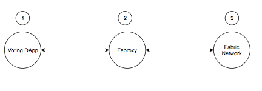

## Blockchain DApp - {Web3, Ethereum, Solidity, Hyperledger Fabric, Chaincode EVM}
Simple Web3 Hyperledger Fabric - Hyperledger [Burrow EVM](https://github.com/hyperledger/burrow) Voting Decentralized Application

With few clicks, run smart contracts from Solidity onto Ethereum Virtual Machine (EVM) that is embedded into Hyperledger Fabric to compiles these contracts as bytecode, of course, with the help of the chaincode.

* The following architecture puts together an understanding of the component blocks that are making the application work:


<hr>

  .	setup/install the development environment: fabric + chain code evm<br>
	.	writing a contract<br>
	.	compiling it<br>
	.	deploying it in the dev environment<br>
	.	interact with the contract on the blockchain within the node.js dapp<br>
	.	vote for candidates, in this case, polls<br>
	.	display the vote counts on a simple web page<br>

<hr>


<hr>

## Before we start
Make sure to have the following prerequisite tools are installed on your machine: [NPM](https://www.npmjs.com/), [Node](https://nodejs.org/en/), [Go](https://golang.org/dl/), [Docker](https://www.docker.com/)

These scripts in this project have been tried and are macOS compatible but if there are machine issues, then follow the steps [here](https://github.com/hyperledger/fabric-chaincode-evm/blob/master/examples/EVM_Smart_Contracts.md) to bring up the needed containers, peers and fabproxy up and running.

## STEPS



<hr>

__Read the full tutorial on how to build this application:__

* <b>STEP 1 - `./start.sh` - run this script file</b>

* <b>STEP 2 - copy/paste the following by sections in the same terminal:</b>

```bash
1) # COPY/PASTE SECTION 1 IN THE TERMINAL
export CORE_PEER_MSPCONFIGPATH=/opt/gopath/src/github.com/hyperledger/fabric/peer/crypto/peerOrganizations/org1.example.com/users/Admin@org1.example.com/msp
export CORE_PEER_ADDRESS=peer0.org1.example.com:7051
export CORE_PEER_LOCALMSPID="Org1MSP"
export CORE_PEER_TLS_ROOTCERT_FILE=/opt/gopath/src/github.com/hyperledger/fabric/peer/crypto/peerOrganizations/org1.example.com/peers/peer0.org1.example.com/tls/ca.crt

2) # COPY/PASTE SECTION 2 IN THE TERMINAL
peer chaincode install -n evmcc -l golang -v 0 -p github.com/hyperledger/fabric-chaincode-evm/evmcc
peer chaincode instantiate -n evmcc -v 0 -C mychannel -c '{"Args":[]}' -o orderer.example.com:7050 --tls --cafile /opt/gopath/src/github.com/hyperledger/fabric/peer/crypto/ordererOrganizations/example.com/orderers/orderer.example.com/msp/tlscacerts/tlsca.example.com-cert.pem
```
* <b>STEP 3 - copy/paste the already cloned fabric-chaincode-evm in a _new_ terminal:</b>

> To help you find your <YOUR_HOME_PATH_TO> run: `./pathfinder.sh` and copy/paste the result below

Note: Take into consideration that running `./start/sh` will remove existing docker containers and images

```bash
# COPY/PASTE THE FOLLOWINGS IN A NEW TERMINAL
1) cd <YOUR_HOME_PATH_TO>/go/src/github.com/hyperledger/fabric-chaincode-evm  
2) go build -o fab3 ./fabproxy/cmd  
3) ./fab3
```
The fabproxy will running at `localhost:5000`

* Go to the project's path and run the web app locally:

```javascript
1) npm install
2) npm start
```

Open your browser at: [localhost:3000](http://localhost:3000)

<hr>


<hr>


<hr>


<hr>


<hr>

## References

* [Fabric](https://github.com/hyperledger/fabric-samples)
* [Hyperledger Fabric Chaincode EVM](https://github.com/hyperledger/fabric-chaincode-evm)
* [Solifity](https://solidity.readthedocs.io/en/v0.4.25/index.html)
* [Web3](https://web3js.readthedocs.io/en/1.0/)
* [Ethereum JSON RPC API](https://github.com/ethereum/wiki/wiki/JSON-RPC)

## License
[Apache 2.0](LICENSE)
